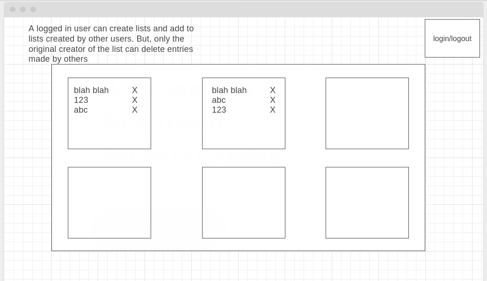
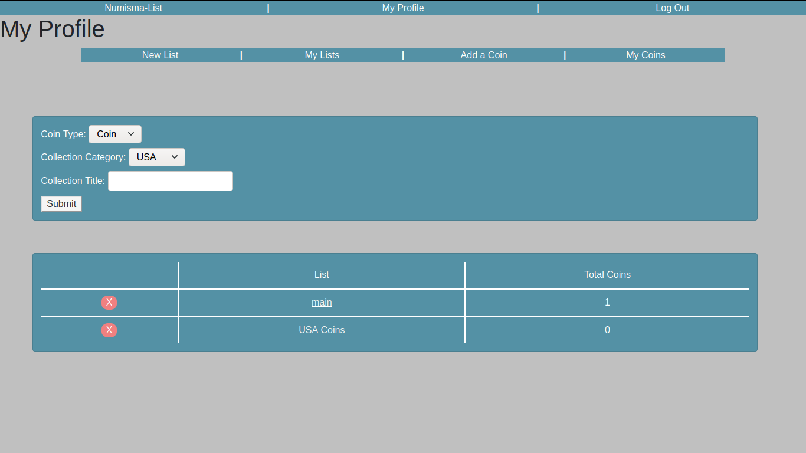
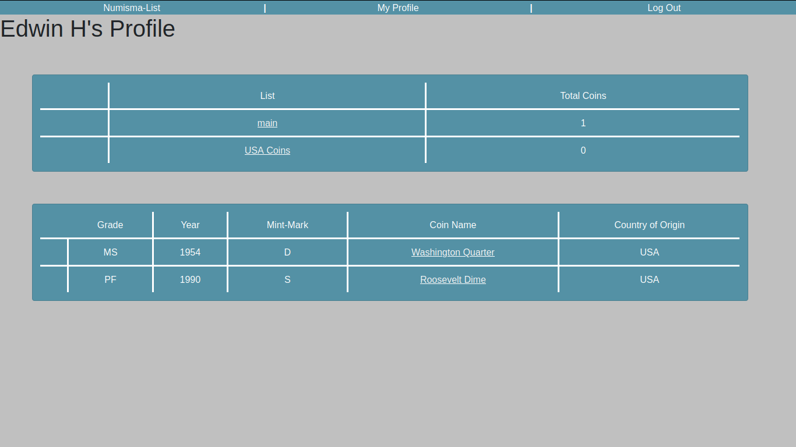

# Numisma-List

## Description
This is a node.js based browser library which can be used to store information about your coin collection.

## Demo
https://aplaple.herokuapp.com/

## Trello Board
https://trello.com/b/4pMVnAc2/numisma-list

## Wireframe

## Actual usage

## Technologies Used
  
HTML, CSS, Javascript, ejs, node.js, express, mongodb, mongoose, Google oAuth 2.0, nodemon
  

## Credits
http://getbootstrap.com/

## Future Enhancements

* Allowing indiviual users to create their own customized lists
* Allowing users to collaborate and create/edit lists together
* Create an API of existing coins to allow for faster additions
